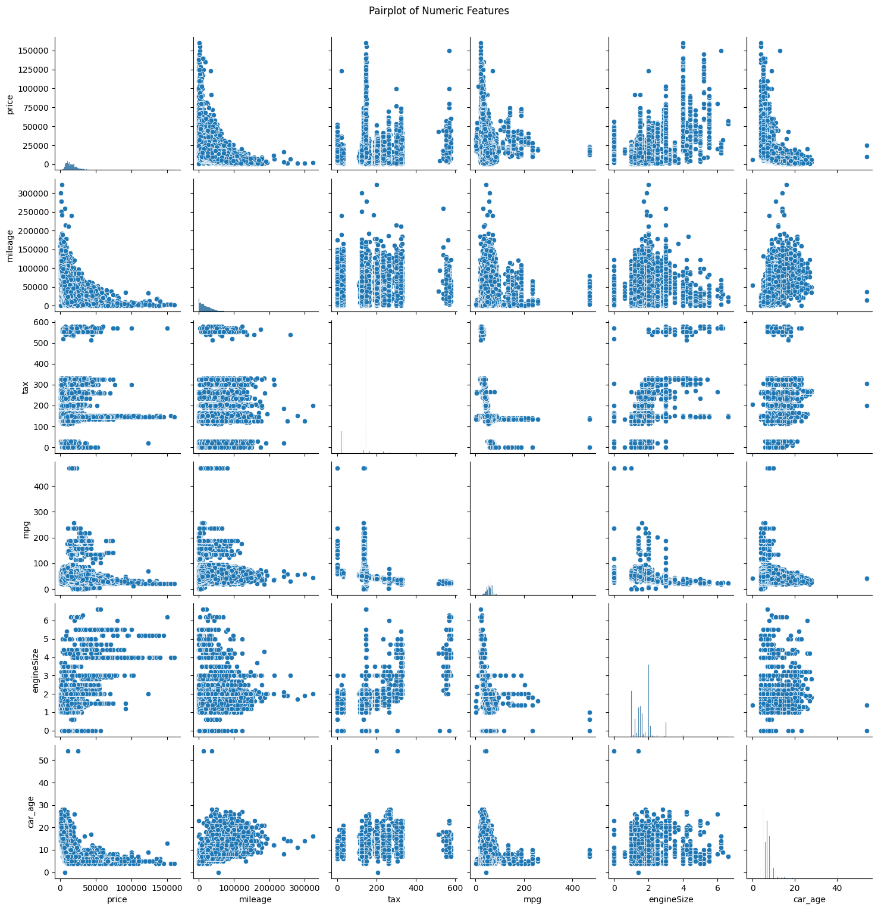

## <i>Abstract</i>
<i>In recent years, the demand for automobiles has surged, driven by technological advancements, economic growth, and changing consumer preferences. Consequently, the car market has experienced a big growth, creating a need for reliable pricing mechanisms. However, the car market is often subject to manipulation by a limited number of entities, leading to inaccurate valuations and pricing disparities. This project aims to address this challenge by leveraging supervised machine learning algorithms to study trends in prices and develop a robust predictive model. Through the application of various machine learning techniques, including linear regression, decision trees, and ensemble methods, we analyze a comprehensive dataset encompassing vehicle characteristics, sale prices, and conditions. By using data pre-processing, training, and model evaluation procedures, we identify an accurate and reliable algorithm for predicting car prices. Our study not only highlights the potential of machine learning in predicting car values but also provides insights into the factors that shape these prices. The proposed predictive models empower both buyers and sellers by offering data-driven price estimates, promoting transparency and informed decision-making within the used car market. By comparing the performance of different machine learning algorithms and interpreting the trained models, we contribute to the existing body of knowledge in this domain and establish a foundation for further research and practical applications in the automotive industry. The findings presented in this report have the potential to help the used car market, fostering fair pricing practices and enhancing the overall experience for all stakeholders involved.</i>

## 1. Introduction
The car market has experienced substantial growth in recent years, fueled by technological advancements, economic factors, and changing consumer preferences. With over 70 million passenger cars produced globally in 2016 alone, the demand for having vehicles has surged, giving rise to a secondary market. The advent of online portals and e-commerce platforms has further facilitated the need for buyers and sellers to be well-informed about the trends and patterns that determine the value of a car.

Predicting the selling price of a car correctly is now very important as it is affecting different groups like people buying or selling cars, companies in the car industry, and organizations that set prices. However, determining fair market prices for cars remains a complex task, sometimes because a few groups control how prices are set and can influence them.

There isn't a standard way to decide how much a car should cost because various websites use various approaches. By using statistical models to predict prices, we can get an initial idea of the price without needing to input all the information on a specific website. This study aims to compare three prediction models to see which one is more accurate at estimating the retail price of a car.

Machine learning, a part of artificial intelligence, has become a valuable method for solving difficult prediction tasks. By using previous data about cars' features, selling prices, and market situations, machine learning programs can understand the patterns and connections, making it possible to predict prices. Many research projects have looked into using supervised learning methods like linear regression, decision trees, and ensemble techniques to create models that can predict car prices.

## 2. Methodology
### 2.1 System
The project contains a dataset and multiple machine learning models to find the best model suitable for the dataset.

*Figure 1: System Diagram*

### 2.2 Required Software
The technology stack for this project contains, google colab as the code editor and python as the language. Several python packages are used, which includes: pandas for handling dataset, matplotlib and seaborn for data visualization, scikit-learn for pre-processing tools like label encoder, min max scaler and dataset split. Scikit-learn was also used to import all the models and the evaluation matrices.

### 2.3 Dataset
A dataset was collected from Kaggle which contains over 97 000 data. For each car, the following attributes are collected: model, year, price, transmission, mileage, fuel type, tax, miles per gallon, engine size and manufacturer.

### 2.4 Data Visualization
Before pre-processing, we need to visualize the data distribution and check for outliers.

*Figure 2: Price Distribution*

Figure 2 shows the price distribution and it can be seen that the data is not a normal distribution.
The dataset has four numeric features: mileage, year, tax and miles per gallon

*Figure 3: Box Plot of Numeric Values*

*Figure 4: Pair plot of numeric values before pre-processing*

From figure 3 and figure 4 it can be seen that the data are not distributed evenly and there are a lot of outliers.

### 2.5 Data Pre-processing
Data pre-processing step involves handling missing values, feature engineering, removing outliers, encoding categorical data into numeric data, feature scaling, data augmentation and splitting the dataset.

At first, it is checked if there are any missing values in the dataset. However, the dataset did not contain any missing values. A new feature, car age is added by subtracting the year column from the current year.

For removing outliers, boundary values for mileage, car age, tax, miles per gallon, engine size and fuel economy was set, and any data outside the boundary was removed. Any particular model having total cars less than 300 is dropped.

There are four categorical data: model, transmission, fuel type and manufacturer. The categorical data were encoded into numeric data. For this step, label encoding is used. Label encoder assigns a unique numerical label to each category.

The data was then further tweaked for feature scaling. In this step, Min Max Scaler was used, which is a method used for scaling or normalizing numerical features. Min Max Scaler rescales the features between 0 and 1.

After filtering and removing outliers, the size of remaining data was 42 000, so we performed data augmentation to increase the size. For data augmentation we applied Gaussian noise to the numerical features. This technique can help create slight variations of the existing data points. After data augmentation, the final size of the dataset was 85 000.

*Figure 5: Pair plot of numeric values after pre-processing*

Finally, the dataset is split into three parts: training, testing and validation. 80\% of the data was in training partition, 10\% for testing and 10\% for validation

### 2.6 Implemented Models
For implementation, 6 models are used. These are: Linear regression, K nearest neighbor, Support Vector Machine, Random Forest, AdaBoost and Gradient Boosting. To find the best hyperparameters for optimal performance, we used GridSearchCV from scikit learn.
#### 2.6.1 Linear Regression
Linear regression is used to model the relationship between the target variable (price) and the features. The goal of linear regression to find the best-fitting straight line through the data points that can be used to predict the price based on the values features.

#### 2.6.2 K-Nearest Neighbor (KNN)
K Nearest Neighbor or KNN is a type of instance-based learning, where the model makes predictions based on the similarity of new data points to previously seen data points. In this model data is compared to all the existing records for locating the best match. The parameter k specifies the number of nearest neighbors to consider when making a prediction. In a regression model, when predicting a new data, the algorithm finds the k nearest neighbors. In this model, we used k value of 9, brute force algorithm and distance-based weighting for searching the nearest neighbor.

#### 2.6.3 Random Forest
Random Forest is an extension of decision trees and an ensemble learning algorithm used by combining multiple trees into a single model. These decision trees are trained and their predictions are aggregated to produce a final result. During training, multiple decision trees are trained independently on the samples of the training data. At the time of making prediction each tree in the forest makes a prediction for a new data. Then these predictions are aggregated to produce the final result. We used 100 decision trees as the n estimator parameter in this model.

#### 2.6.4 Support Vector Machine (SVM)
SVM or Support Vector Machine is a supervised learning algorithm which is capable of performing linear and non-linear regression tasks. SVM finds the optimal hyperplane that best separates the data points of different classes. The hyperplane is chosen to maximize the margin between the closest points of the classes. In this project, Support Vector Regression (SVR) which is an extension of SVM, is used. The fundamental idea in SVR is similar to SVM but with different optimization objectives. In SVR, the goal is to identify a function that closely matches the target values, ensuring that the predictions remain within a specified distance from the actual values. We used the polynomial kernel hyperparameter.

#### 2.6.5 AdaBoost
AdaBoost which is the short form of Adaptive Boosting, is an ensemble learning technique that combines multiple weak learners to create a strong model. It focuses on boosting the performance of models by sequentially training weak learners, typically decision trees, and adjusting their weights based on their accuracy. AdaBoost uses simple models as weak learners. These models individually may not perform well but can be combined to form a strong model. The final model is a weighted sum of all the weak learners. The weights are determined by the accuracy of each learner, that is, more accurate learners have higher weights. The adjusted hyperparameters of adaBoost includes decision tree as the base estimator, which had a maximum depth of 7.

#### 2.6.6 Gradient Boosting
Gradient Boosting is another ensemble learning technique which used for regression and classification tasks. It builds a model by combining the outputs of several weak learners, typically decision trees. Gradient boosting and AdaBoost share the same goal, but they differ in their approaches to combining weak learners. Gradient Boosting uses the method uses gradient descent to minimize a loss function. The loss function measures how well the model is performing, and gradient descent is used to optimize this function. In each iteration, the algorithm calculates the errors of the current model. A new weak learner is then trained to predict these errors. The final prediction is the sum of the predictions from all the weak learners, weighted by some learning rate. Some hyperparameters were adjusted, like the number of learners, learning rate, maximum depth, and minimum samples needed to split a node.

## 3. Results and Evaluation
For evaluating our models, we used four evaluation matrices. These are Mean absolute error (MAE), Mean squared error (MSE), Root mean squared error (RMSE) and R^{2}score.

Mean absolute error or MAE is the average of the absolute differences between the predicted and actual values. It is calculated by measuring the average magnitude of errors. Lower MAE values indicate better model performance as the metric shows how close predictions are to the actual outcomes on average.

Mean Squared Error or MSE is the average of the squared differences between the predicted and actual values. Which means it gives a higher weight to larger errors, making it useful for identifying models with significant prediction errors.Lower MSE values indicate better model performance. Since it squares the errors, larger errors have a more significant impact on the MSE which makes it sensitive to outliers.

Root Mean Squared Error (RMSE) is the square root of the MSE. It provides an error metric that is in the same unit as the target variable, making it easy to interpret. Lower RMSE values indicate better model performance. This metric is useful when large errors are particularly undesirable, as it penalizes them more than MAE.

$R^{2}$ is also known as the coefficient of determination which represents the proportion of the variance in the dependent variable that is predictable from the independent variables. $R^{2}$ values range from 0 to 1.$R^{2}$ value of 1 indicates that the regression predictions perfectly fit the data. And $R^{2}$ value of 0 indicates that the model does not explain any of the variability in the target variable.

### <b>3.1 Linear Regression</b>
Linear regression establishes a linear relationship between the target variable and the features. Linear Regression model was used to provide a starting point for the project. However, the performance of the Linear Regression model was relatively poor compared to the other models. Table 1 shows that this model achieved a MAE score of 2430.25, MSE score of 9244678.17, RMSE score of 3040.51, and an $R^{2}$ score of 0.60 on the test dataset. These metrics indicate higher prediction errors and a lower proportion of variance in the target variable. The Linear Regression model likely underperformed due to its inability to capture non-linear relationships and interactions within the dataset, which more complex models could handle better, resulting in more precise and reliable predictions.

### <b>3.2 K-Nearest Neighbor (KNN)</b>
The K-Nearest Neighbors (KNN) model did very well compared to other models. According to Table 1, it had a Mean Absolute Error (MAE) of 874.76, a Mean Squared Error (MSE) of 1 505 732.64, a Root Mean Squared Error (RMSE) of 1 227.08, and an $R^{2}$ score of 0.93. These numbers show that the KNN model made small prediction errors and explained a lot of the variance in the target variable. It did much better than the Linear Regression model. The KNN model's strong performance is because it can handle non-linear relationships in the data by looking at the similarity between nearby data points. The way it uses distance-based weighting and searches for neighbors helped it perform well.

### <b>3.3 Random Forest</b>
The Random Forest model performed very well. It had a Mean Absolute Error (MAE) of 861.26, a Mean Squared Error (MSE) of 1 445 187.14, a Root Mean Squared Error (RMSE) of 1 202.16, and an $R^{2}$ score of 0.94, indicating very low prediction errors. Its performance was comparable to the KNN and Gradient Boosting models. Random Forest's strong results come from its ensemble approach, where it builds multiple decision trees and averages their predictions to improve accuracy and control overfitting.

### <b>3.4 Support Vector Machine (SVM)</b>
The Support Vector Machine (SVM) model's performance was average, recording a Mean Absolute Error (MAE) of 2158.92, Mean Squared Error (MSE) of 7 635 707.87, Root Mean Squared Error (RMSE) of 2763.28, and an $R^{2}$ score of 0.67. These results suggest that the SVM had higher prediction errors and explained less variance in the target variable compared to models like KNN, Random Forest, and Gradient Boosting. The SVM, using a polynomial kernel, might have struggled to effectively capture the complex, non-linear relationships in the dataset.

### <b>3.5 AdaBoost</b>
The AdaBoost model performed reasonably well, although it was not the best among the models tested. It had a Mean Absolute Error (MAE) of 1430.21, Mean Squared Error (MSE) of 3039766.33, Root Mean Squared Error (RMSE) of 1743.49, and an R-squared score of 0.87. These scores mean that the prediction errors were relatively low, and the model could explain a good amount of the variation in the target variable. While AdaBoost did not match the top performance of KNN, Random Forest, or Gradient Boosting models, it still showed solid prediction abilities.

### <b>3.6 Gradient Boosting</b>
Gradient Boosting model has one of the best scores. It had a Mean Absolute Error (MAE) of 913.78, Mean Squared Error (MSE) of 1514667.69, Root Mean Squared Error (RMSE) of 1230.72, and an R-squared score of 0.93. These scores mean that the prediction errors were low, and the model could explain a large part of the variation in the target variable, similar to the KNN and Random Forest models. The Gradient Boosting model did well because it can build an ensemble of weak learners, where each new learner corrects the mistakes of the previous one. This approach allows it to find complex patterns and relationships in the data effectively.

Overall, KNN, Random Forest, and Gradient Boosting emerged as the top performers, excelling in accuracy and error minimization. These models effectively captured complex relationships in the data, showcasing their robustness for car price prediction.

*Figure 4: Comparison of model performance*

## 4. Conclusion
We were trying to predict the selling price of the used cars based on the dataset provided at Kaggle. To predict this dataset we used six machine learning algorithms: Linear regression, K nearest neighbor, Random forest, Support vector machine, AdaBoost and Gradient Boosting. The prediction of these models are compared with the test dataset and the evaluation of the prediction is  further evaluated using different methods. From figure 6, we can see conclude that the performance of K nearest neighbor, Random forest and Gradient boosting were better than the other models. These three models are highly accurate in predicting the price of cars.
